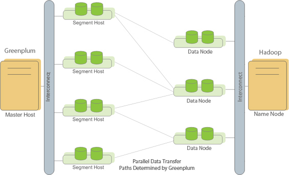

# gphdfs:// Protocol \(Deprecated\) 

The `gphdfs://` protocol specifies an external file path on a Hadoop Distributed File System \(HDFS\).

**Note:** The `gphdfs` external table protocol is deprecated and will be removed in the next major release of Greenplum Database. Consider using the Greenplum Platform Extension Framework \(PXF\) [pxf](g-pxf-protocol.html) external table protocol to access data stored in a Hadoop file system.

The protocol allows specifying external files in Hadoop clusters configured with or without Hadoop HA \(high availability\) and in MapR clusters. File names may contain wildcard characters and the files can be in `CSV`, `TEXT`, or custom formats.

When Greenplum links with HDFS files, all the data is read in parallel from the HDFS data nodes into the Greenplum segments for rapid processing. Greenplum determines the connections between the segments and nodes.

Each Greenplum segment reads one set of Hadoop data blocks. For writing, each Greenplum segment writes only the data it contains. The following figure illustrates an external table located on a HDFS file system.

The `FORMAT` clause describes the format of the external table files. Valid file formats are similar to the formatting options available with the PostgreSQL `COPY` command and user-defined formats for the `gphdfs` protocol. If the data in the file does not use the default column delimiter, escape character, null string and so on, you must specify the additional formatting options so that Greenplum Database reads the data in the external file correctly. The `gphdfs` protocol requires a one-time setup. See [One-time HDFS Protocol Installation](g-one-time-hdfs-protocol-installation.html).

**Parent topic:**[Defining External Tables](../external/g-external-tables.html)

