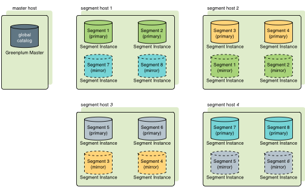

# Overview of Segment Mirroring 

When Greenplum Database High Availability is enabled, there are two types of segments: *primary* and *mirror*. Each primary segment has one corresponding mirror segment. A primary segment receives requests from the master to make changes to the segment's database and then replicates those changes to the corresponding mirror. If Greenplum Database detects that a primary segment has failed or become unavailable, it changes the role of its mirror segment to primary segment and the role of the unavailable primary segment to mirror segment. Transactions in progress when the failure occurred roll back and must be restarted. The administrator must then recover the mirror segment, allow the mirror to syncronize with the current primary segment, and then exchange the primary and mirror segments so they are in their preferred roles.

Segment mirroring employs a physical file replication scheme—data file I/O at the primary is replicated to the secondary so that the mirror's files are identical to the primary's files. Data in Greenplum Database are represented with *tuples*, which are packed into *blocks*. Database tables are stored in disk files consisting of one or more blocks. A change to a tuple changes the block it is saved in, which is then written to disk on the primary and copied over the network to the mirror. The mirror updates the corresponding block in its copy of the file.

For heap tables, blocks are saved in an in-memory cache until they are evicted to make room for newly changed blocks. This allows the system to read or update a block in memory multiple times without performing expensive disk I/O. When the block is evicted from the cache, it is written to disk and replicated to the secondary. While the block is held in cache, the primary and mirror have different images of the block. However, the databases are still consistent because the transaction log has been replicated. If a mirror takes over for a failed primary, the transactions in its log are applied to the database tables.

Other database objects — for example filespaces, which are tablespaces internally represented with directories—also use file replication to perform various file operations in a synchronous way.

Append-optimized tables do not use the in-memory caching mechanism. Changes made to append-optimized table blocks are replicated to the mirror immediately. Typically, file write operations are asynchronous, while opening, creating, and synchronizing files are "sync-replicated," which means the primary blocks until it receives the acknowledgment from the secondary.

If a primary segment fails, the file replication process stops and the mirror segment automatically starts as the active segment instance. The now active mirror's system state becomes *Change Tracking*, which means the mirror maintains a system table and change-log of all blocks updated while the primary segment is unavailable. When the failed primary segment is repaired and ready to be brought back online, an administrator initiates a recovery process and the system goes into *Resynchronization* state. The recovery process applies the logged changes to the repaired primary segment. The system state changes to *Synchronized* when the recovery process completes.

If the mirror segment fails or becomes inaccessible while the primary is active, the primary's system state changes to *Change Tracking*, and it tracks changes to be applied to the mirror when it is recovered.

Mirror segments can be placed on hosts in the cluster in different configurations, as long as the primary and mirror instance for a segment are on different hosts. Each host must have the same number of primary and mirror segments. The default mirroring configuration is *group mirroring*, where the mirror segments for each host's primary segments are placed on one other host. If a single host fails, the number of active primary segments doubles on the host that backs the failed host. [Figure 1](#fig_rrr_nt2_xt) illustrates a group mirroring configuration.

*Spread mirroring* spreads each host's mirrors over multiple hosts so that if any single host fails, no other host will have more than one mirror promoted to the active primary segment. Spread mirroring is possible only if there are more hosts than segments per host. [Figure 2](#fig_ew1_qgg_xt) illustrates the placement of mirrors in a spread segment mirroring configuration.

The Greenplum Database utilities that create mirror segments support group and spread segment configurations. Custom mirroring configurations can be described in a configuration file and passed on the command line.

**Parent topic:**[Overview of Greenplum Database High Availability](../../highavail/topics/g-overview-of-high-availability-in-greenplum-database.html)

