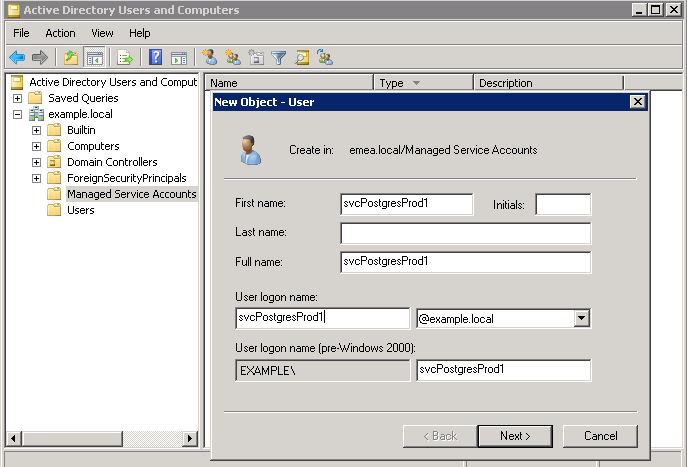
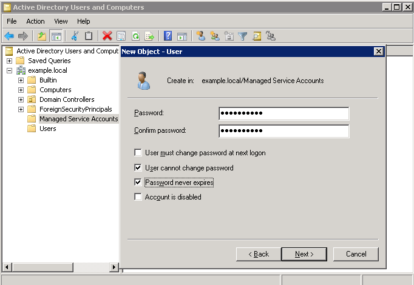
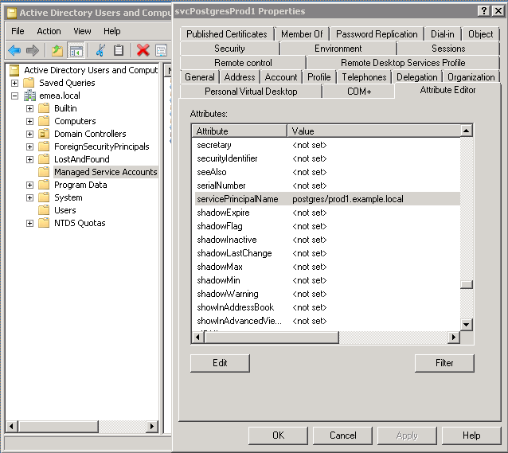
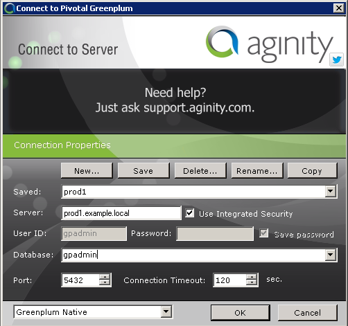
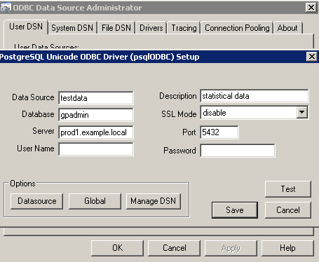

# Configuring Kerberos For Windows Clients 

You can configure Microsoft Windows client applications to connect to a Greenplum Database system that is configured to authenticate with Kerberos.

-   [Configuring Kerberos on Windows for Greenplum Database Clients](#topic_vjg_d5m_sv)
-   [Configuring Client Authentication with Active Directory](#topic_uzb_t5m_sv)

For information about configuring Greenplum Database with Kerberos authentication, see [Using Kerberos Authentication](kerberos.html).

**Parent topic:** [Configuring Client Authentication](client_auth.html)

## Configuring Kerberos on Windows for Greenplum Database Clients 

When a Greenplum Database system is configured to authenticate with Kerberos, you can configure Kerberos authentication for the Greenplum Database client utilities `gpload` and `psql` on a Microsoft Windows system. The Greenplum Database clients authenticate with Kerberos directly, not with Microsoft Active Directory \(AD\).

This section contains the following information.

-   [Installing Kerberos on a Windows System](#win_kerberos_install).
-   [Running the psql Utility](#win_psql_kerb)
-   [Example gpload YAML File](#win_gpload_kerb)
-   [Creating a Kerberos Keytab File](#win_keytab)
-   [Issues and Possible Solutions](#win_kerberos_issues)

These topics assume that the Greenplum Database system is configured to authenticate with Kerberos and Microsoft Active Directory. See [Configuring Client Authentication with Active Directory](#topic_uzb_t5m_sv).

### Installing Kerberos on a Windows System 

To use Kerberos authentication with the Greenplum Database clients on a Windows system, the MIT Kerberos Windows client must be installed on the system. For the clients you can install MIT Kerberos for Windows 4.0.1 \(for krb5\) that is available at [http://web.mit.edu/kerberos/dist/index.html](http://web.mit.edu/kerberos/dist/index.html).

On the Windows system, you manage Kerberos tickets with the Kerberos `kinit` utility

The automatic start up of the Kerberos service is not enabled. The service cannot be used to authenticate with Greenplum Database.

Create a copy of the Kerberos configuration file `/etc/krb5.conf` from the Greenplum Database master and place it in the default Kerberos location on the Windows system `C:\ProgramData\MIT\Kerberos5\krb5.ini`. In the file section `[libdefaults]`, remove the location of the Kerberos ticket cache `default_ccache_name`.

On the Windows system, use the environment variable `KRB5CCNAME` to specify the location of the Kerberos ticket. The value for the environment variable is a file, not a directory and should be unique to each login on the server.

This is an example configuration file with `default_ccache_name` removed. Also, the section `[logging]` is removed.

```
[libdefaults]
 debug = true
 default_etypes = aes256-cts-hmac-sha1-96
 default_realm = EXAMPLE.LOCAL
 dns_lookup_realm = false
 dns_lookup_kdc = false
 ticket_lifetime = 24h
 renew_lifetime = 7d
 forwardable = true

[realms]
 EXAMPLE.LOCAL = {
  kdc =bocdc.example.local
  admin_server = bocdc.example.local
 }

[domain_realm]
 .example.local = EXAMPLE.LOCAL
 example.local = EXAMPLE.LOCAL
```

When specifying a Kerberos ticket with `KRB5CCNAME`, you can specify the value in either a local user environment or within a session. These commands set `KRB5CCNAME`, runs `kinit`, and runs the batch file to set the environment variables for the Greenplum Database clients.

```
set KRB5CCNAME=%USERPROFILE%\krb5cache
kinit

"c:\Program Files (x86)\Greenplum\greenplum-clients-<version>\greenplum_clients_path.bat"
```

### Running the psql Utility 

After installing and configuring Kerberos and the Kerberos ticket on a Windows system, you can run the Greenplum Database command line client `psql`.

If you get warnings indicating that the Console code page differs from Windows code page, you can run the Windows utility `chcp` to change the code page. This is an example of the warning and fix.

```
psql -h prod1.example.local warehouse
psql (8.3.23)
WARNING: Console code page (850) differs from Windows code page (1252)
 8-bit characters might not work correctly. See psql reference
 page "Notes for Windows users" for details.
Type "help" for help.

warehouse=# \q

chcp 1252
Active code page: 1252

psql -h prod1.example.local warehouse
psql (8.3.23)
Type "help" for help.
```

### Creating a Kerberos Keytab File 

You can create and use a Kerberos `keytab` file to avoid entering a password at the command line or the listing a password in a script file when connecting to a Greenplum Database system. You can create a keyab file with these utilities:

-   Windows Kerberos utility `ktpass`
-   Java JRE keytab utility `ktab`

    If you use AES256-CTS-HMAC-SHA1-96 encryption, you need to download and install the Java extension *Java Cryptography Extension \(JCE\) Unlimited Strength Jurisdiction Policy Files for JDK/JRE* from Oracle. This command creates the keyab file `svcPostgresProd1.keytab`.


You run the `ktpass` utility as an AD Domain Administrator. The utility expects a user account to have a Service Principal Name \(SPN\) defined as an AD user attribute, however, it does not appear to be required. You can specify it as a parameter to `ktpass` and ignore the warning that it cannot be set.

The Java JRE `ktab` utility does not require an AD Domain Administrator and does not require an SPN.

**Note:** When you enter the password to create the keytab file, the password is visible on screen.

This example runs the `ktpass` utility to create the ketyab `dev1.keytab`.

```
ktpass -out dev1.keytab -princ dev1@EXAMPLE.LOCAL -mapUser dev1 -pass <your_password> -crypto all -ptype KRB5_NT_PRINCIPAL
```

It works despite the warning message `Unable to set SPN mapping data`.

This example runs the Java `ktab.exe` to create a keytab file \(`-a` option\) and list the keytab name and entries \(`-l` `-e` `-t` options\).

```
C:\Users\dev1>"\Program Files\Java\jre1.8.0_77\bin"\ktab -a dev1
Password for dev1@EXAMPLE.LOCAL:<your_password>
Done!
Service key for dev1 is saved in C:\Users\dev1\krb5.keytab

C:\Users\dev1>"\Program Files\Java\jre1.8.0_77\bin"\ktab -l -e -t
Keytab name: C:\Users\dev1\krb5.keytab
KVNO Timestamp Principal
---- -------------- ------------------------------------------------------
 4 13/04/16 19:14 dev1@EXAMPLE.LOCAL (18:AES256 CTS mode with HMAC SHA1-96)
 4 13/04/16 19:14 dev1@EXAMPLE.LOCAL (17:AES128 CTS mode with HMAC SHA1-96)
 4 13/04/16 19:14 dev1@EXAMPLE.LOCAL (16:DES3 CBC mode with SHA1-KD)
 4 13/04/16 19:14 dev1@EXAMPLE.LOCAL (23:RC4 with HMAC)
```

You can then use a keytab with the following:

```
kinit -kt dev1.keytab dev1
or
kinit -kt %USERPROFILE%\krb5.keytab dev1
```

### Example gpload YAML File 

This is an example of running a `gpload` job with the user `dev1` logged onto a Windows desktop with the AD domain.

In the example `test.yaml` control file, the `USER:` line has been removed. Kerberos authentication is used.

```
---
VERSION: 1.0.0.1
DATABASE: warehouse
HOST: prod1.example.local
PORT: 5432

GPLOAD:
   INPUT:
    - SOURCE:
         PORT_RANGE: [18080,18080]
         FILE:
           - /Users/dev1/Downloads/test.csv
    - FORMAT: text
    - DELIMITER: ','
    - QUOTE: '"'
    - ERROR_LIMIT: 25
    - LOG_ERRORS: true
   OUTPUT:
    - TABLE: public.test
    - MODE: INSERT
   PRELOAD:
    - REUSE_TABLES: true
```

These commands run `kinit` and then `gpload` with the `test.yaml` file and displays successful `gpload` output.

```
kinit -kt %USERPROFILE%\krb5.keytab dev1

gpload.py -f test.yaml
2016-04-10 16:54:12|INFO|gpload session started 2016-04-10 16:54:12
2016-04-10 16:54:12|INFO|started gpfdist -p 18080 -P 18080 -f "/Users/dev1/Downloads/test.csv" -t 30
2016-04-10 16:54:13|INFO|running time: 0.23 seconds
2016-04-10 16:54:13|INFO|rows Inserted = 3
2016-04-10 16:54:13|INFO|rows Updated = 0
2016-04-10 16:54:13|INFO|data formatting errors = 0
2016-04-10 16:54:13|INFO|gpload succeeded
```

### Issues and Possible Solutions 

-   This message indicates that Kerberos cannot find your cache file:

    ```
    Credentials cache I/O operation failed XXX
    (Kerberos error 193)
    krb5_cc_default() failed
    ```

    To ensure that Kerberos can find the file set the environment variable `KRB5CCNAME` and run `kinit`.

    ```
    set KRB5CCNAME=%USERPROFILE%\krb5cache
    kinit
    ```

-   This `kinit` message indicates that the `kinit -k -t` command could not find the keytab.

    ```
    kinit: Generic preauthentication failure while getting initial credentials
    ```

    Confirm the full path and filename for the Kerberos keytab file is correct.


## Configuring Client Authentication with Active Directory 

You can configure a Microsoft Windows user with a Microsoft Active Directory \(AD\) account for single sign-on to a Greenplum Database system.

You configure an AD user account to support logging in with Kerberos authentication.

With AD single sign-on, a Windows user can use Active Directory credentials with a Windows client application to log into a Greenplum Database system. For Windows applications that use ODBC, the ODBC driver can use Active Directory credentials to connect to a Greenplum Database system.

**Note:** Greenplum Database clients that run on Windows, like `gpload`, connect with Greenplum Database directly and do not use Active Directory. For information about connecting Greenplum Database clients on Windows to a Greenplum Database system with Kerberos authentication, see [Configuring Kerberos on Windows for Greenplum Database Clients](#topic_vjg_d5m_sv).

This section contains the following information.

-   [Prerequisites](#ad_prereq)
-   [Setting Up Active Directory](#ad_setup)
-   [Setting Up Greenplum Database for Active Directory](#gpdb_ad_setup)
-   [Single Sign-On Examples](#ad_sso_examples)
-   [Issues and Possible Solutions for Active Directory](#ad_problems)

### Prerequisites 

These items are required enable AD single sign-on to a Greenplum Database system.

-   The Greenplum Database system must be configured to support Kerberos authentication. For information about configuring Greenplum Database with Kerberos authentication, see [Configuring Kerberos For Windows Clients](#topic1).
-   You must know the fully-qualified domain name \(FQDN\) of the Greenplum Database master host. Also, the Greenplum Database master host name must have a domain portion. If the system does do not have a domain, you must configure the system to use a domain.

    This Linux `hostname` command displays the FQDN.

    ```
    hostname --fqdn
    ```

-   You must confirm that the Greenplum Database system has the same date and time as the Active Directory domain. For example, you could set the Greenplum Database system NTP time source to be an AD Domain Controller, or configure the master host to use the same external time source as the AD Domain Controller.
-   To support single sign-on, you configure an AD user account as a Managed Service Account in AD. These are requirements for Kerberos authentication.

    -   You need to add the Service Principal Name \(SPN\) attribute to the user account information because the Kerberos utilities require the information during Kerberos authentication.
    -   Also, as Greenplum Database has unattended startups, you must also provide the account login details in a Kerberos keytab file.
    **Note:** Setting the SPN and creating the keytab requires AD administrative permissions.


### Setting Up Active Directory 

The AD naming convention should support multiple Greenplum Database systems. In this example, we create a new AD Managed Service Account `svcPostresProd1` for our `prod1` Greenplum Database system master host.

The Active Directory domain is `example.local`.

The fully qualified domain name for the Greenplum Database master host is `prod1.example.local`.

We will add the SPN `postgres/prod1.example.local` to this account. Service accounts for other Greenplum Database systems will all be in the form `postgres/fully.qualified.hostname`.



In this example, the AD password is set to never expire and cannot be changed by the user. The AD account password is only used when creating the Kerberos keytab file. There is no requirement to provide it to a database administrator.



An AD administrator must add the Service Principal Name attribute to the account from the command line with the Windows `setspn` command. This example command set the SPN attribute value to `postgres/prod1.example.local` for the AD user `svcPostgresProd1`:

```
setspn -A postgres/prod1.example.local svcPostgresProd1
```

You can see the SPN if Advanced Features are set in the Active Directory Users and Computers view. Find `servicePrincipalName` in the Attribute Editor tab and edit it if necessary.



The next step is to create a Kerberos keytab file.

You can select a specific cryptography method if your security requirements require it, but in the absence of that, it is best to get it to work first and then remove any cryptography methods you do not want.

As an AD Domain Administrator, you can list the types of encryption that your AD domain controller supports with this `ktpass` command:

```
ktpass /? 
```

As an AD Domain Administrator, you can run the `ktpass` command to create a keytab file. This example command creates the file `svcPostgresProd1.keytab` with this information:

-   ServicePrincipalName \(SPN\): `postgres/prod1.example.local@EXAMPLE.LOCAL`
-   AD user: `svcPostgresProd1`
-   Encryption methods: `ALL available on AD`
-   Principal Type: `KRB5_NT_PRINCIPAL`

```
ktpass -out svcPostgresProd1.keytab -princ postgres/prod1.example.local@EXAMPLE.LOCAL -mapUser svcPostgresProd1
   -pass <your_password> -crypto all -ptype KRB5_NT_PRINCIPAL
```

**Note:** The AD domain `@EXAMPLE.LOCAL` is appended to the SPN.

You copy the keytab file `svcPostgresProd1.keytab` to the Greenplum Database master host.

As an alternative to running `ktpass` as an AD Domain Administrator, you can run the Java `ktab.exe` utility to generate a keytab file if you have the Java JRE installed on your desktop. When you enter the password using either `ktpass` or `ktab.exe`, the password will be visible on the screen as a command ling argument.

This example command creates the keyab file `svcPostgresProd1.keytab`.

```
"c:\Program Files\Java\jre1.8.0_77\bin\ktab.exe" -a svcPostgresprod1 -k svcPostgresProd1.keytab
Password for svcPostgresprod1@EXAMPLE.LOCAL:<your_password>
Done!
Service key for svcPostgresprod1 is saved in svcPostgresProd1.keytab
```

**Note:** If you use AES256-CTS-HMAC-SHA1-96 encryption, you must download and install the Java extension *Java Cryptography Extension \(JCE\) Unlimited Strength Jurisdiction Policy Files for JDK/JRE* from Oracle.

### Setting Up Greenplum Database for Active Directory 

These instructions assume that the Kerberos workstation utilities `krb5-workstation` are installed on the Greenplum Database master host.

Update `/etc/krb5.conf` with the AD domain name details and the location of an AD domain controller. This is an example configuration.

```
[logging]
 default = FILE:/var/log/krb5libs.log
 kdc = FILE:/var/log/krb5kdc.log
 admin_server = FILE:/var/log/kadmind.log

[libdefaults]
 default_realm = EXAMPLE.LOCAL
 dns_lookup_realm = false
 dns_lookup_kdc = false
 ticket_lifetime = 24h
 renew_lifetime = 7d
 forwardable = true

[realms]
 EXAMPLE.LOCAL = {
 kdc = bocdc.example.local
 admin_server = bocdc.example.local
 }

[domain_realm]
 .example.local = EXAMPLE.LOCAL
 example.com = EXAMPLE.LOCAL
```

Copy the Kerberos keytab file that contains the AD user information to the Greenplum Database master directory. This example copies the `svcPostgresProd1.keytab` that was created in [Active Directory Setup](#ad_setup).

```
mv svcPostgresProd1.keytab $MASTER_DATA_DIRECTORY
chown gpadmin:gpadmin $MASTER_DATA_DIRECTORY/svcPostgresProd1.keytab
chmod 600 $MASTER_DATA_DIRECTORY/svcPostgresProd1.keytab
```

Add this line as the last line in the Greenplum Database `pg_hba.conf` file. This line configures Greenplum Database authentication to use Active Directory for authentication for connection any attempt that is not matched by a previous line.

```
host all all 0.0.0.0/0 gss include_realm=0
```

Update the Greenplum Database `postgresql.conf` file with the location details for the keytab file and the principal name to use. The fully qualified host name and the default realm from `/etc/krb5.conf` forms the full service principal name.

```
krb_server_keyfile = '/data/master/gpseg-1/svcPostgresProd1.keytab'
krb_srvname = 'postgres'
```

Create a database role for the AD user. This example logs into the default database and runs the `CREATE ROLE` command. The user `dev1` was the user specified when creating the keytab file in [Active Directory Setup](#ad_setup).

```
psql
create role dev1 with login superuser;
```

Restart the database to use the updated authentication information:

```
gpstop -a
gpstart  
```

**Note:** The Greenplum Database libraries might conflict with the Kerberos workstation utilities such as `kinit`. If you are using these utilities on the Greenplum Database master, you can either run a `gpadmin` shell that does not source the `$GPHOME/greenplum_path.sh` script, or unset the `LD_LIBRARY_PATH` environment variable similar to this example:

```
unset LD_LIBRARY_PATH
kinit
source $GPHOME/greenplum_path.sh
```

Confirm Greenplum Database access with Kerberos authentication:

```
kinit dev1
psql -h prod1.example.local -U dev1
```

### Single Sign-On Examples 

These single sign-on examples that use AD and Kerberos assume that the AD user `dev1` configured for single sign-on is logged into the Windows desktop.

This example configures Aginity Workbench for Greenplum Database. When using single sign-on, you enable Use Integrated Security.



This example configures an ODBC source. When setting up the ODBC source, do not enter a User Name or Password. This DSN can then be used by applications as an ODBC data source.



You can use the DSN `testdata` with an R client. This example configures R to access the DSN.

```
library("RODBC")
conn <- odbcDriverConnect("testdata")
sql <- "select * from public.data1"
my_data <- sqlQuery(conn,sql)
print(my_data)
```

### Issues and Possible Solutions for Active Directory 

-   Kerberos tickets contain a version number that must match the version number for AD.

    To display the version number in your keytab file, use the `klist -ket` command. For example:

    ```
    klist -ket svcPostgresProd1.keytab
    ```

    To get the corresponding value from AD domain controller, run this command as an AD Administrator:

    ```
    kvno postgres/prod1.example.local@EXAMPLE.LOCAL
    ```


-   This login error can occur when there is a mismatch between the Windows ID and the Greenplum Database user role ID. This log file entry shows the login error. A user `dev22` is attempting to login from a Windows desktop where the user is logged in as a different Windows user.

    ```
    2016-03-29 14:30:54.041151 PDT,"dev22","gpadmin",p15370,th2040321824,
      "172.28.9.181","49283",2016-03-29 14:30:53 PDT,1917,con32,,seg-1,,,x1917,sx1,
      "FATAL","28000","authentication failed for user ""dev22"": valid 
      until timestamp expired",,,,,,,0,,"auth.c",628,
    ```

    The error can also occur when the user can be authenticated, but does not have a Greenplum Database user role.

    Ensure that the user is using the correct Windows ID and that a Greenplum Database user role is configured for the user ID.

-   This error can occur when the Kerberos keytab does not contain a matching cryptographic type to a client attempting to connect.

    ```
    psql -h 'hostname' postgres
    psql: GSSAPI continuation error: Unspecified GSS failure. Minor code may provide more information
    GSSAPI continuation error: Key version is not available
    ```

    The resolution is to add the additional encryption types to the keytab using `ktutil` or recreating the postgres keytab with all crypto systems from AD.


