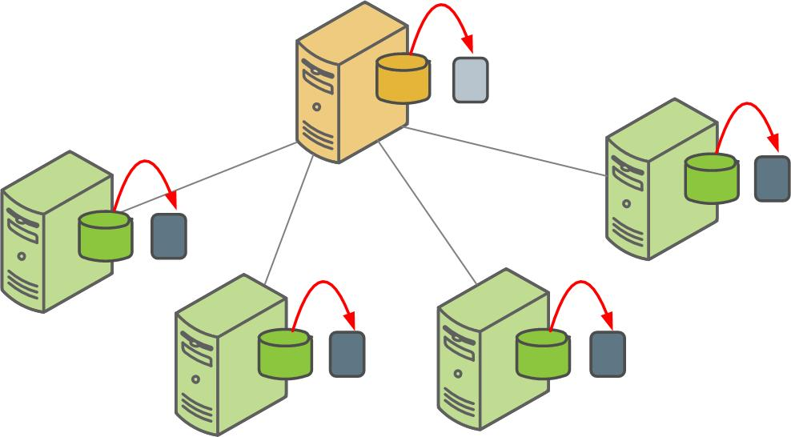
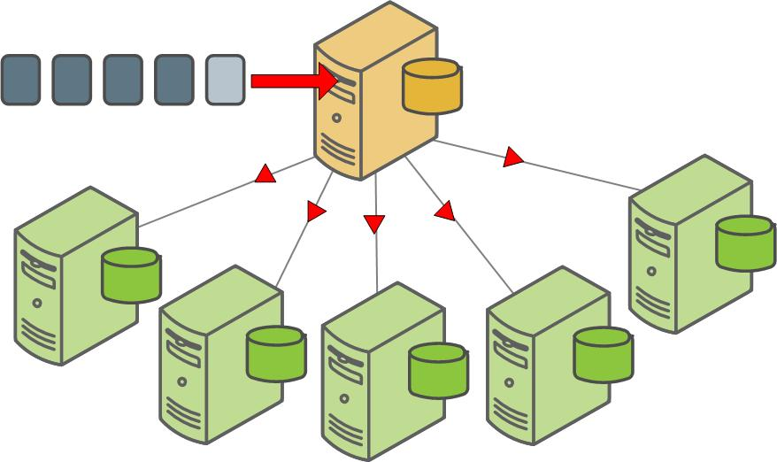

# Backup and Restore Overview 

Greenplum Database supports parallel and non-parallel methods for backing up and restoring databases. Parallel operations scale regardless of the number of segments in your system, because segment hosts each write their data to local disk storage simultaneously. With non-parallel backup and restore operations, the data must be sent over the network from the segments to the master, which writes all of the data to its storage. In addition to restricting I/O to one host, non-parallel backup requires that the master have sufficient local disk storage to store the entire database.

## Parallel Backup with gpcrondump and gpdbrestore 

The Greenplum Database parallel dump utility `gpcrondump` backs up the Greenplum master instance and each active segment instance at the same time.

By default, `gpcrondump` creates dump files in the `db_dumps` subdirectory of each segment instance. On the master, `gpcrondump` creates several dump files, containing database information such as DDL statements, the system catalog tables, and metadata files. On each segment, `gpcrondump` creates one dump file, which contains commands to recreate the data on that segment. Each file created for a backup begins with a 14-digit timestamp key that identifies the backup set the file belongs to.

The `gpdbrestore` parallel restore utility takes the timestamp key generated by `gpcrondump`, validates the backup set, and restores the database objects and data into a distributed database. Parallel restore operations require a complete backup set created by `gpcrondump`, a full backup, and any required incremental backups. As the following figure illustrates, all segments restore data from local backup files simultaneously.

The `gpdbrestore` utility provides flexibility and verification options for use with the automated backup files produced by `gpcrondump` or with backup files moved from the Greenplum cluster to an alternate location. See [Restoring Greenplum Databases](restore-parallel.html). `gpdbrestore` can also be used to copy files to the alternate location.

## Parallel Backup with gpbackup and gprestore 

`gpbackup` and `gprestore` are new utilities that are designed to improve the performance, functionality, and reliability of backups as compared to `gpcrondump` and `gpdbrestore`. `gpbackup` utilizes `ACCESS SHARE` locks at the individual table level, instead of `EXCLUSIVE` locks on the `pg_class` catalog table. This enables you to execute DML statements during the backup, such as `CREATE`, `ALTER`, `DROP`, and `TRUNCATE` operations, as long as those operations do not target the current backup set.

Backup files created with `gpbackup` are designed to provide future capabilities for restoring individual database objects along with their dependencies, such as functions and required user-defined datatypes. See [Parallel Backup with gpbackup and gprestore](backup-gpbackup.html) for more information.

## Non-Parallel Backup with pg\_dump 

The PostgreSQL `pg_dump` and `pg_dumpall` non-parallel backup utilities can be used to create a single dump file on the master host that contains all data from all active segments.

The PostgreSQL non-parallel utilities should be used only for special cases. They are much slower than using the Greenplum backup utilities since all of the data must pass through the master. Additionally, it is often the case that the master host has insufficient disk space to save a backup of an entire distributed Greenplum database.

The `pg_restore` utility requires compressed dump files created by `pg_dump` or `pg_dumpall`. Before starting the restore, you should modify the `CREATE TABLE` statements in the dump files to include the Greenplum `DISTRIBUTED` clause. If you do not include the `DISTRIBUTED` clause, Greenplum Database assigns default values, which may not be optimal. For details, see `CREATE TABLE` in the *Greenplum Database Reference Guide*.

To perform a non-parallel restore using parallel backup files, you can copy the backup files from each segment host to the master host, and then load them through the master. See [Restoring to a Different Greenplum System Configuration](restore-diff-system.html).

Another non-parallel method for backing up Greenplum Database data is to use the `COPY TO` SQL command to copy all or a portion of a table out of the database to a delimited text file on the master host.

**Parent topic:** [Backing Up and Restoring Databases](../managing/backup-main.html)

