--- 
title: "Greenplum Database Cloud Release Notes for AWS v6.7"
---

VMware Tanzu Greenplum on AWS is available with two different deployment templates. One template creates all resources needed for your VMware Tanzu Greenplum cluster, including the Virtual Private Cloud and subnet. The other template uses an existing VPC and subnet.

CloudFormation template version 6.7 is based on:
-   [VMware Tanzu Greenplum Database version 6.19.0](https://gpdb.docs.pivotal.io/5290/relnotes/gpdb-5292-release-notes.html) or 
-   [VMware Tanzu Greenplum Database version 5.29.2](https://gpdb.docs.pivotal.io/5290/relnotes/gpdb-5294-release-notes.html) or
-   [VMware Tanzu Greenplum Database version 4.3.33](https://gpdb.docs.pivotal.io/archive/index.html#4333)

## <a id="tools-features"></a>Cloud Native and Cloud Managed Tools and Features

|Utility/Feature | Description |
|------|---------------|
|bouncer|Command line utility that simplifies using pgBouncer connection pooler.|
|gpcompute|Grow or shrink compute independently of storage. Additionally, migrate segment hosts seamlessly to R5b series instance type from R5 series instance type (or) vice versa.|
|gpgrow|Grow storage independently of compute.
|gpmaintain/gpcronmaintain|Automates routine maintenance of VMware Tanzu Greenplum such as vacuum and analyzing tables.|
|gpoptional|Installation tool for installing optional components such as MADlib and Command Center.|
|gppower|Automates the Pausing and Resuming a cluster to save on infrastructure costs.|
|gprelease/gpcronrelease|Automates the upgrade of VMware Tanzu Greenplum, any optional components installed, and the cloud utilities.|
|gpsnap/gpcronsnap|Automates the execution of snapshot backups and restores using the cloud vendor's native snapshot utilities.|
|Self-healing|Automatic instance replacement and recovery in a failure event.|

## <a id="licensing"></a>Licensing

Greenplum on AWS BYOL is licensed by the number of cores deployed, and it is important to note that in AWS, **2 vCPUs equal 1 core** because of hyper-threading. Customers will total the number of vCPUs deployed in the cluster, divide by 2, and then purchase that many subscription cores from VMware Tanzu.

## <a id="calculating storage"></a>Calculating Usable Storage

To determine the storage size of the deployment, multiply the number of segment instances in the cluster times the number of disks per instance, and times the size of each disk chosen to get the raw storage. Divide the raw storage by two because of mirroring and then multiply this by .7 to leave space for transaction and temp files.

Example:
( 16 Segment Instances * 3 Disks * 2TB Disks ) = 96 TB Raw Storage ( 96 / 2 ) * .7 = 33.6 TB Usable Storage 

# <a id="deploying"></a>Deploying Greenplum on AWS

VMware Tanzu Greenplum on AWS can be deployed with one of two different Cloud Formation Templates. One template creates all resources needed for deployment, while the other relies on using an existing VPC. These differences are in the Network section of the two templates, with everything else remaining the same.

## <a id="stack name"></a>Stack Name
This identifies the VMware Tanzu Greenplum Stack. Stack is an AWS term which basically means cluster, making it easier to manage all of the resources used in the deployment.

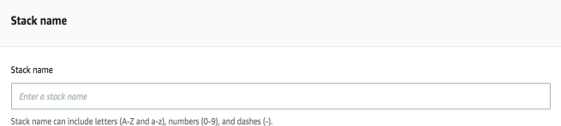

## <a id="network"></a>Network
The network section differs between deploying to a new VPC or deploying to an existing VPC.

### <a id="internet access"></a>Internet Access
This parameter is available for both templates. "True" means a Public IP address will be created for the Master Instance with ports 22, 5432, 28080, and 28090 open to the Internet. "False" means the Master will not have a Public IP address created, and a jump box will be needed to access the cluster.

### <a id="new vpc cluster"></a>New VPC Cluster

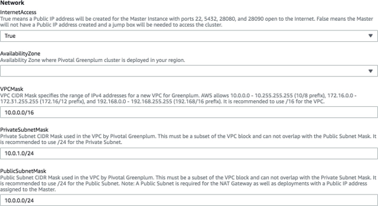

#### <a id="availability zone"></a>Availability Zone
An Availability Zone is an isolated area within a geographic tegion. It is analogous to a physical data center.

### <a id="vpc mask"></a>VPC Mask
VPC CIDR Mask specifies the range of IPv4 addresses for a new VPC for Greenplum. AWS allows 10.0.0.0 - 10.255.255.255 (10/8 prefix), 172.16.0.0 - 172.31.255.255 (172.16/12 prefix), and 192.168.0.0 - 192.168.255.255 (192.168/16 prefix). It is recommended to use /16 for the VPC.

### <a id="private subnet mask"></a>Private Subnet Mask
Private Subnet CIDR Mask used in the VPC by VMware Tanzu Greenplum. This must be a subset of the VPC block, and cannot overlap with the Public Subnet Mask. It is recommended to use /24 for the Private Subnet.

### <a id="public subnet mask"></a>Public Subnet Mask
Public Subnet CIDR Mask used in the VPC by VMware Tanzu Greenplum. This must be a subset of the VPC block, and cannot overlap with the Private Subnet Mask. It is recommended to use /24 for the Public Subnet. 

Note: A Public Subnet is required for the NAT Gateway as well as a deployment with a Public IP address assigned to the Master.

### <a id="existing VPC cluster"></a>Existing VPC Cluster

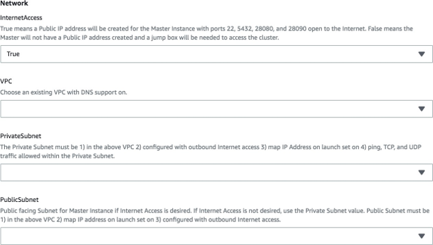

### <a id="VPC"></a>VPC

Choose an existing VPC to deploy your cluster. The VPC must have DNS support on.

### <a id="private subnet"></a>Private Subnet

The Private Subnet must be 1) in the above VPC 2) configured with outbound Internet access 3) map IP Address on launch set on 4) ping, TCP, and UDP traffic allowed within the Private Subnet.

### <a id="public subnet"></a>Public Subnet

Public facing subnet for master instance if internet access is desired. If not, use the private subnet value. Public Subnet must be 1) in the above VPC 2) map IP address on launch set on 3) configured with outbound internet access.

## <a id="aws configuration"></a>AWS Configuration

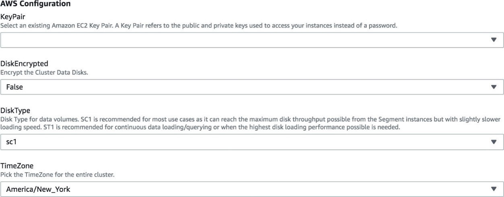

### <a id="key pair"></a>Key Pair

This is the name of your AWS private key. It is used to ssh to the master instance after the stack is created.

### <a id="disk encrypted"></a>Disk Encrypted

Specifies to use AWS EBS disk encryption for the data disks. The swap disk will also be encrypted.

### <a id="disk type"></a>Disk Type

Specify the disk type for the data volumes in your cluster. SC1 is recommended for most use cases as it can reach the maximum disk throughput possible from the Segment instances. ST1 is recommended for continuous data loading/querying or when the highest disk loading performance possible is needed. SC1 disks are significantly less expensive than ST1.

Tip: You can leverage the `gpsnap` utility to change the disk type after your deployment has been completed. This is done by creating a snapshot with `gpsnap`, then restoring that snapshot using a different disk type.

### <a id="time zone"></a>Time Zone

Pick the time zone you wish to use for the virtual machines in your cluster.

## <a id="greenplum configuration"></a>Greenplum Configuration

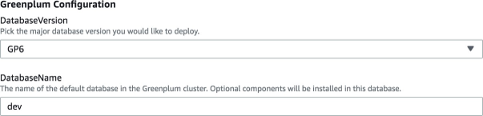

### <a id="database version"></a>Database Version

Pick the major database version you wish to use. GP4, GP5 and GP6 are currently available with this release.

### <a id="database name"></a>Database Name

This defines the default database name for your Greenplum cluster. Optional components will be installed in this database.

## <a id="master instance"></a>Master Instance

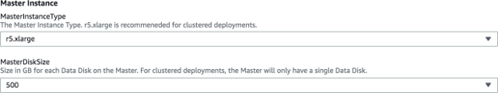

### <a id="master instance type"></a>Master Instance Type

Specifies the instance type for the master instance. The r5.xlarge instance type is recommended for multi-instance deployments.

### <a id="master disk size"></a>Master Disk Size

Specifies the size in GB for the data disks on the Master Instance. For multi-instance deployments, the master will only have one disk.

## <a id="segment instances"></a>Segment Instances

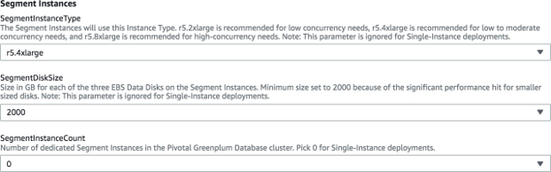

### <a id="segment instance type"></a>Segment Instance Type

Amazon supports many different instance types, but this has been limited to three different types. The r5.2xlarge is recommended for single-user clusters, r5.4xlarge for a great balance of single- user performance and moderate concurrency, and r5.8xlarge for high concurrency needs. 

Note: This parameter is ignored for Single-Instance deployments.

Tip: You can leverage the `gpcompute` utility to change the instance type after your deployment has been completed.

### <a id="segment disk size"></a>Segment Disk Size

Size in GB for each EBS volume. There are 3 EBS volumes per each segment instance.

### <a id="segment instance count"></a>Segment Instance Count

Choose the number of segment instances in your deployment. The more instances you deploy, the better the performance. Choose 0 to deploy a single-instance cluster.

Tip: If deploying a single-instance cluster, some cloud utilities will not work fully.-   `gpcompute` will not change the size of the master instance
-   `gppower` will not pause the master instance
-   `gpgrow` will not grow the master instance

## <a id="master instance"></a>AWS CloudFormation

Deployment is very simple in the AWS Marketplace. Simply provide the parameters in the user interface and submit the CloudFormation template to create the stack.

### <a id="create in progress"></a>Create In Progress

During the stack deployment, CloudFormation will indicate that the stack is being created with CREATE_IN_PROGRESS status.

### <a id="create complete"></a>Create Complete

During the stack deployment, CloudFormation will indicate that the stack is being created with CREATE_IN_PROGRESS status.

### <a id="EC2 instances"></a>EC2 Instances

Each instance contains a suffix in the name to indicate the role of mdw (master) or sdwn (segment) as shown below.


### <a id="CloudFormation output"></a>Cloud Formation Output

The Outputs tab of the CloudFormation stack will have the connection information to the database once the stack reaches the CREATE_COMPLETE Status.

As shown below, the Output section will contain all of the information needed to start using your stack. Note that the password shown below is randomly generated and not stored by VMware Tanzu.

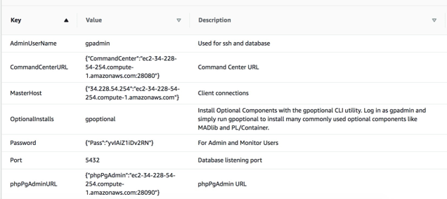

## <a id="security"></a>Security

The randomly-generated password can be changed for `gpmon` and `gpadmin`. It is recommended to keep these passwords in sync too. This is done inside a database session as shown below.

```
ALTER USER gpadmin PASSWORD '<new_password>'; 
ALTER USER gpmon PASSWORD '<new_password>'
```

After updating the database passwords, you need to update configuration files.

1.	/home/gpadmin/.pgpass
        The format for this file is as follows:

```
localhost:5432:pgbouncer:gpadmin:<new password> 
mdw:6432:*:gpadmin:<new password>
*:6432:gpperfmon:gpmon:<new password>
```

2.	/opt/pivotal/greenplum/variables.sh
        Find the GPADMIN_PASSWORD variable and update the value set as follows:

```
GPADMIN_PASSWORD="<new password>"
```

3.	/data1/master/pgbouncer/userlist.txt
        Use the encrypted value for the password from pg_shadow for the `gpadmin` user.

```
psql -t -A -c "SELECT passwd FROM pg_shadow \ 
WHERE usename = 'gpadmin'"
```

The encrypted value will begin with "md" and use this in the file with the following format:

```
"gpadmin" "<encrypted password>" 
```

The reason for storing the password in /opt/pivotal/variables.sh is to make a snapshot backup restore work properly. If you take a backup of your cluster and restore it to another cluster, the password stored inside the database is unlikely to match the pgBouncer and the .pgpass configuration. In another scenario, you might take a snapshot of the database, update the database password, then restore your snapshot -- which again causes a conflict of configuration files not matching the database.

During a snapshot restore, the `gpsnap` utility uses the password stored in
/opt/pivotal/greenplum/variables.sh to set the database passwords for `gpmon` and `gpadmin`, and update the pgBouncer and .pgpass configuration files. This ensures that a snapshot restore will work properly.

## <a id="connecting"></a>Connecting

Connecting can be done with the web-based GP Browser database client, ssh, or with an external database client tool like pgAdmin 4. The deployment output for master instance, port, admin username, and password used to connect to Greenplum. Note that the password in the output is the database password for user `gpadmin`, and not the password for ssh.

### <a id="phpPgAdmin"></a>phpPgAdmin

This is a VMware Tanzu enhanced version of the popular phpPgAdmin web-based SQL tool. It has been configured to start automatically on the master instance. The URL is provided in the deployment output. Connection is done by simply using the admin `gpadmin` user and the provided database password.


Tip:  phpPgAdmin uses Apache HTTP server and does not include an SSL certificate. If you plan on using this tool across the internet, it is highly recommended that you configure Apache with an SSL certificate.

### <a id="ssh access"></a>SSH Access

Use the SSH KeyName provided when creating the stack to connect with ssh and use the AdminUserName. For example:

```
ssh -i my_private_key.pem gpadmin@34.196.112.102
```

Once connected via ssh, the message of the day provides detailed information about the stack as shown below.

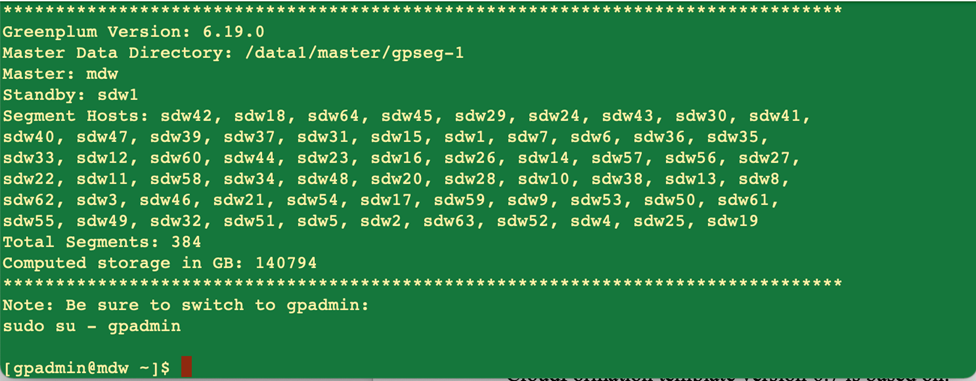

### <a id="client tool"></a>Client Tool

Connecting with a remote client utility like pgAdmin 4 or DBeaver is also very easy to do using the Master public IP address and password provided in the CloudFormation Output. Connect as the AdminUserName (gpadmin) and use the provided password found in the CloudFormation Output.

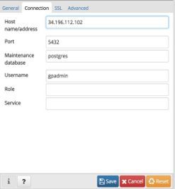

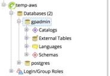

## <a id="additional resources"></a>Additional Resources

Installation of VMware Tanzu Greenplum on AWS includes detailed logs plus supplemental installs and validation scripts that can be executed after the initial installation is complete.

### <a id="aws logs"></a>AWS Logs

Logs for the deployment of the Stack can be found in /opt/pivotal/greenplum/rollout.log. A log file is on every instance, but the master instance will have more detailed information regarding the database initialization.

### <a id="validation"></a>Validation

Validation includes scripts to run industry standard benchmarks of TPC-H and TPC-DS. It also includes scripts to validate the disk and network performance of the cluster using the VMware Tanzu Greenplum utility "gpcheckperf".

TPC tests should be executed as root on the master instance. Use the "sudo bash" command to start a session as root, then navigate to /opt/pivotal/greenplum/validation/tpc-ds or
/opt/pivotal/greenplum/validation/tpc-h and run the "run_once.sh" script, then follow the directions.

The performance scripts should be run with the database stopped. (`gpstop -a`) and can be run as `gpadmin`. This is located in /opt/pivotal/greenplum/validation/performance.

# <a id="gp on aws additional features"></a>Greenplum on AWS Additional Features

## <a id="bouncer"></a>bouncer

pgBouncer is a load balancing utility that is included with Greenplum. This utility allows far greater connections to the database with less impact on resources. It is recommended to use pgBouncer instead of connecting directly to the database. More information on pgBouncer is available in the Greenplum documentation.

The bouncer utility automates the starting, stopping, pausing, and resuming of pgBouncer. Use this utility to manage pgBouncer on your cluster.

pgBouncer is configured to listen on port 5432 -- the default port that is usually used by Greenplum. Greenplum has been configured to listen on port 6432.

Authentication has been configured to use "md5", which is an encrypted password. Create users and assign passwords in Greenplum as usual, and pgBouncer will authenticate users with the database passwords you set.

Pooling has been configured for "transaction" with max client connections of 1000 and max database connections to 10. These settings can be changed, but the defaults provide a good starting point for most installations.

Configuration and logs for pgBouncer are located in /data1/master/pgbouncer on the master instance.

Note that for JDBC connections, you may need to add "search_path" to the `ignore_startup_parameters` configuration. Add "prepareThreshold=0" to your JDBC URL also.

Connections can optionally be made with SSL to secure connections from your client to the database. Actions available with bouncer include start, stop, pause, and resume.

bouncer <action>

Disabling pgBouncer in your AWS cluster is not recommended, because several tools and features rely on pgBouncer. You can still connect to the database directly with port 6432. If you want to do this, you may need to update the AWS Security Group to allow access to port 6432.

## <a id="gpcompute"></a>gpcompute

The `gpcompute` utility enables you to add or reduce the compute capacity of your cluster independent of your storage. The command completely automates and integrates with AWS to change the instance type of the segment instances.

The status command will show you the current instance type of your segment instances and show the instance type of the current launch template.

```
gpcompute status
```

The command will accept these six different instance types in AWS: r5.2xlarge, r5.4xlarge, r5.8xlarge, r5b.2xlarge, r5b.4xlarge and r5b.8xlarge. This command facilitates seamless migration of segment hosts from R5 series instance type to R5b series instance type, or vice versa.

```
gpcompute <instance_type>
```

2xlarge is ideal for single-user workloads. 4xlarge provides improved single-user performance and increased concurrency performance. Lastly, 8xlarge will provide nearly the same single-user performance, but an increase in concurrency performance. 

## <a id="gpgrow"></a>gpgrow

Increase the disk size of segment instances in your cluster completely online with this utility. Segment instances have three data disks each, and the data size is specified in GB. 

AWS only allows increasing a disk size, and it can only be modified once every six hours. This is an online activity, so the database does not need to be stopped. The --master-only switch allows you to alter the disk size of the Master node.

gpgrow <new disk size>

Increase the disk size of segment instances in your cluster completely online with this utility. Segment Instances have three data disks each, and the data size is specified in GB. 

AWS only allows increasing a disk size, and it can only be modified once every six hours. This is an online activity, so the database does not need to be stopped. The --master-only switch allows you to alter the disk size of the Master node.

```
gpgrow <new disk size>
 
gpgrow <new disk size> --master-only
```

## <a id="gpmaintain./gpcronmaintain"></a>gpmaintain/gpcronmaintain

The `gpmaintain` utility automates basic maintenance of Greenplum. It analyzes all tables using analyzedb, vacuums tables that are in need, and maintains the catalog.

The `gpcronmaintain` utility is executed via cron and looks at the schedule file in
/usr/local/greenplum-cloud/conf/gpcronmaintain.conf. It runs at 4:00 AM every Saturday by default, but can be configured to run more or less often.

## <a id="gpoptional"></a>gpoptional

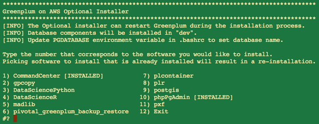

This utility simplifies installing optional components after the deployment has been completed. Simply run `gpoptional` to see the optional installation options. This tool is also used in conjunction with `gprelease` to upgrade or reinstall already installed optional packages.

`phpPgAdmin` and Command Center are installed with every deployment automatically, while MADlib, Data Science Python, Data Science R, PL/R, PostGIS, PL/Container, Backup/Restore, PXF, and `gpcopy` can be installed optionally with `gpoptional`.

## <a id="gppower"></a>gppower

The `gppower` command makes it easy to pause (stop) a cluster to save on infrastructure costs. The command stops the database and all segment instances with `gppower pause`. Resume a cluster with `gppower resume`.

Pausing and resuming with `gppower`:

```
gppower pause 

gppower resume
```

The `gppower` command will stop/start the segment instances, stop/start the database, stop/start PXF (if it was running when paused), stop/start Command Center (if it was running when paused), and pause/resume the Segment Auto-Scaling-Group.

Pausing and resuming self-healing with gppower:

```
gppower asg_pause
  
gppower asg_resume
```

This command will pause/resume only the segment Auto-Scaling-Group.

## <a id="gprelease/gpcronrelease"></a>gprelease/gpcronrelease

The `gprelease` utility upgrades a Greenplum on AWS cluster to the latest minor release available. The tool validates disk space availability, then automatically downloads the binaries, copies it to the instances in the cluster, stops the cluster, installs the new version, and starts the cluster again. 

The tool automatically validates disk space availability and executes `gpoptional` so that optionally installed packages are re-installed or upgraded to a compatible version. 

The `gpcronrelease` utility is the scheduling component of `gprelease`. It checks to see if a new release is available and updates the message of the day to indicate a new version is available. It runs in cron weekly on Sunday at 1:00 AM in the local timezone by default.

## <a id="gpsnap/gpcronsnap"></a>gpsnap/gpcronsnap

The `gpsnap` utility manages creating, listing, deleting, and restoring snapshots. Creating or restoring a snapshot will restart the database.

NOTE: Greenplum 4 (GP4) does not support `gpsnap` and `gpcronsnap`.

The `gpsnap` utility leverages Amazon EBS volume snapshots to quickly create a database backup. In order to get a consistent view of the database, the command first stops the database, then executes AWS commands in parallel to create a snapshot for each disk volume. 

After the disk snapshots are created, the database is restarted. This usually requires only a database outage of 30 seconds to 2 minutes. Each snapshot is tagged so that when a restore is desired, the disk volumes get attached and mounted to the correct instances. This is done automatically with `gpsnap`.

You can restore a snapshot from one cluster to a different one so long as the snapshot is in the same region, and the cluster has the same configuration (number of nodes and disks). Valid snapshots can be found using `gpsnap list`.

You can copy snapshots from one region to another, which is useful for a Disaster Recovery scenario. Simply copy your snapshots with `gpsnap copy` to a different region. In case of disaster, you can create a new cluster with the same configuration in the region where you copied the snapshots, then recover the snapshots using `gpsnap`.

The actions available with `gpsnap` are list, create, delete, restore, and copy. Delete requires an additional parameter of the snapshot_id you wish to delete, restore requires the snapshot_id and the disk type you wish to use, and copy requires the snapshot_id and the target region.

```
gpsnap list gpsnap create
gpsnap delete <snapshot_id>
gpsnap restore <snapshot_id> <disk_type> gpsnap copy <snapshot_id> <region>
```

`gpsnap` restore sets the `gpadmin` and `gpmon` passwords to the value found in
/opt/pivotal/greenplum/variables.sh. A snapshot could be from another cluster that has a different password, which would cause problems unless the passwords are set. The `pgpass` and `pgBouncer` configuration files are also updated with the correct password.

The `gpcronsnap` utility manages the automatic execution of `gpsnap`. By default, there will be a cron job that runs every 10 minutes and uses the configuration file /usr/local/greenplum- cloud/conf/gpcronsnap.conf to determine if a snapshot is needed.

`gpcronsnap.conf`

```
#This utility will only execute `gpsnap` once on the day(s) of the week you specify.

#maximum number of snapshots; delete the oldest when max reached max_snapshots=4

#snapshot day of week (1..7); 1 is Monday #to specify daily, use (1 2 3 4 5 6 7) snapshot_dow=(7)

#time of day to run the snapshot
#do not schedule a time where the snapshot may not finish until the next day #do not schedule a time that conflicts with gpcronmaintain snapshot_time=03:00
```

As shown above, the default schedule is a weekly snapshot on Sunday at 3:00 AM in the local timezone. Four snapshots will be retained before the oldest snapshot will be automatically deleted.

## <a id="self-healing"></a>Self Healing

Greenplum on AWS products utilizes two AWS Auto Scaling Group (ASG) resources. One is used to deploy the master instance, and the other is to deploy the segment instances. The ASG monitors the virtual machines, and if there is a failure, the VM will get replaced automatically by AWS.

On startup of the new virtual machine instance, the initialization scripts will automatically self-heal the cluster. The roles for instances are master and segment, and based on the role, the self-healing will execute different commands to restore the cluster to 100% operational status.

All new instances interact with the Systems Manager Parameter Store (SSM) to retrieve the private and public keys for this stack. This enables the new instance to interact with the existing instances in the cluster, and be added without human intervention.

Note that the EBS volumes on the affected instances will also be replaced during the healing process.

### <a id="segment healing"></a>Segment Healing

In the unlikely event of an instance failure on AWS, this is the most likely instance to fail because of the number of segment instances. Secondly, the load on the segments is far greater than the master, so this may expose a hardware problem more readily than a master. Then the ASG may decide to replace the instance.

The segment healing process first executes `gprecoverseg`, which is a Greenplum utility, to replace the failed instance with the new instance. This command is executed a second time to rebalance the data to the new instance, but before this is done, `pgBouncer` is paused. Pausing `pgBouncer` allows currently running queries to complete, but does not allow new queries to start. 

Once all current queries have stopped, the rebalance starts. Once complete, `pgBouncer` is resumed. Database activity may continue during the segment healing process and connections can still occur to `pgBouncer`.

### <a id="standby-master healing"></a>Standby-Master Healing

If the first segment instance that has the Standby-Master process fails, the self-healing process will recover automatically. 

The Standby-Master process is restarted automatically. Database activity may continue during the Standby-Master Healing process.

### <a id="master healing"></a>Master Healing

If the master fails, the new instance executes a few Greenplum utilities. The process will first failover to the Standby-Master, and a database shutdown will follow immediately. The Standby-Master is then returned back to a Standby-Master role, and the new master instance is set as the master.

It is important to understand that in AWS, the new VM that replaces a bad one will have new disks. This includes the root and data volumes.

-	If missing, the default database will be created, and the .bashrc file will have PGDATABASE set to the default database name.
-	Optional components such as MADlib and PostGIS will need to be reinstalled.
-	Files stored on the root volume, including the `gpadmin` home directory, will be lost.
-	As the cloud utilities are installed during the healing process, the latest cloud utilities will be downloaded dynamically and used.

## <a id="pxf extension framework"></a>The PXF Extension Framework (PXF)}

Starting with template version 6.3, PXF is installed via gpoptional.

NOTE: Greenplum 4 (GP4) does not support PXF.

The PXF Extension Framework (PXF) provides parallel, high throughput data access, and federated queries across heterogeneous data sources via built-in connectors that map a Greenplum Database external table definition to an external data source. This Greenplum Database extension is based on PXF from Apache HAWQ.

After installing PXF with `gpoptional`, you can use the following commands on the Master (mdw) to manage the cluster.

Start the cluster:

```
pxf cluster start
```

And to stop PXF:

```
pxf cluster stop
```

Self-Healing and upgrades via `gprelease` have been enhanced to restart PXF if the process is found to be running.

## <a id="linux information"></a>Linux Information

### <a id="patching"></a>Patching

After you have deployed your cluster in AWS, you may need to patch the operating system to address vulnerabilities. In order to do that, you have to take a few extra steps than if you were installing on-premise.

First stop the database, `pgBouncer`, PXF (if started), and Command Center (if started).

```
gpcc stop
pxf cluster stop gpstop -a -M fast bouncer stop
```

Next, you need to edit the two AutoScalingGroups (MasterInstance and SegmentInstances) to suspend all processes as shown below. The names will be the name of your stack followed by "- MasterInstance" and "-SegmentInstances".

### <a id="patching"></a>Patching

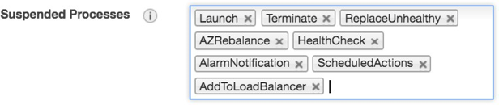

Before running yum update, remove old kernels.

```
gpssh -f /usr/local/greenplum-cloud/conf/all_hosts.txt "sudo package-cleanup -- oldkernels --count=2 -y"
```

Remove old initramfs files.

```gpssh -f /usr/local/greenplum-cloud/conf/all_hosts.txt "sudo rm -f
/boot/initramfs*old*"
```

Make sure lvm2 is installed on all nodes.

```
gpssh -f /usr/local/greenplum-cloud/conf/all_hosts.txt "sudo yum install lvm2 - y"
```

Make sure dmraid is installed on all nodes.

```
gpssh -f /usr/local/greenplum-cloud/conf/all_hosts.txt "sudo yum install dmraid
-y"
```

Edit the /etc/dracut.conf file and make sure add_drivers and add_dracutmodules entries are as follows on all nodes.

```
add_drivers+=" ena "
add_dracutmodules+=" dm lvm dmraid mdraid "
```

If the /etc/dracut.conf file was updated in the above step, run dracut on all nodes.

```
gpssh -f /usr/local/greenplum-cloud/conf/all_hosts.txt "sudo dracut -f -v"
```

Edit the /etc/default/grub file and make sure the GRUB_CMDLINE_LINUX line is as follows on all nodes:

```
GRUB_CMDLINE_LINUX="crashkernel=auto rd.lvm.lv=centos/root console=ttyS0 net.ifnames=0 biosdevname=0 transparent_hugepage=never nvme_core.io_timeout=255"
```

If the /etc/default/grub file was updated in the above step, run grub2-mkconfig on all nodes as follows.

```
gpssh -f /usr/local/greenplum-cloud/conf/all_hosts.txt "sudo grub2-mkconfig | sudo tee /boot/grub2/grub.cfg"
```

Next, use "gpssh -f all_hosts.txt" to connect to all instances via ssh. The all_hosts.txt file is in the `gpadmin` home directory on the master instance. Execute the command to run the yum update. 

```
gpssh -f /usr/local/greenplum-cloud/conf/all_hosts.txt "sudo yum update -y"
```

NOTE: Be patient, because this executes on all instances in parallel. You will not see any output until the command completes on all instances.

Once complete, you can restart the virtual machines.

After all virtual machine instances have started and passed both checks, you may resume the AutoScalingGroup processes. You shouldn't have any suspended processes. Be sure to do this for the two ASGs.


Now you can start the database, `pgBouncer`, PXF (if desired), and Command Center (if desired).

```
gpstart -a 
bouncer start
pxf cluster start 
gpcc start
```

### <a id="core dumps"></a>Core Dumps

Core dumps are enabled, making it easier for Support to debug issues with the database.

Each virtual machine instance has a /var/coredumps directory owned by the `gpadmin` user. These dumps are retained for up to 7 days, then will be automatically purged by the cronjob script /opt/pivotal/greenplum/dump_maintenance.sh.

## <a id="gp on aws tech details history"></a>Greenplum in AWS Technical Details and History

### <a id="aws resources"></a>AWS Resources

#### <a id="ami"></a>Amazon Machine Image

The Amazon Machine Image (AMI) uses CentOS 7.7 with Hardware Virtual Machine (HVM) enabled. 

The HVM EC2 Instance is required to enable enhanced networking. The AMI has all the software packages and pre-reqs for installing VMware Tanzu Greenplum and necessary add-ons, including Intel-enhanced networking drivers.

#### <a id="availability zone"></a>Availability Zone

AWS Data Center locations are independent of one another. VMware Tanzu Greenplum is deployed within a single AZ to ensure the best possible performance.

#### <a id="vpc"></a>VPC

A virtual network is used to logically isolate instances on AWS. The CloudFormation template uses a single VPC. Although a VPC can span multiple availability zones, the CloudFormation template uses only one.

To make management easier and make sure the required VPC settings are made, it is strongly recommended to use a dedicated VPC for VMware Tanzu Greenplum. To connect existing AWS resources from a different VPC, use AWS VPC Peering.

#### <a id="subnet"></a>Subnet

The subnet specifies the IP address range for instances deployed in the VPC. This is the IP address range used by the interconnect traffic for Greenplum. DHCP is used to assign IP addresses to instances deployed in the subnet.

#### <a id="security group"></a>Security Group

The security group defines the protocol, port range, and source for traffic associated with the VPC. All traffic between instances is allowed, and ports 5432, 22, 28080, and 28090 are available to the SSH location chosen.

#### <a id="internet gateway"></a>Internet Gateway

The internet gateway creates a network path to the internet from your VPC.

#### <a id="nat"></a>NAT Gateway

The NAT gateway is required to allow instances to access the Internet without creating a public IP address for each instance.

#### <a id="vpc"></a>Route

The route is modified to allow traffic to the SSH Location specified on the ports defined in the Security Group.

#### <a id="vpc"></a>Autoscaling Group

Two Auto-Scaling-Groups are used with one for the master instance, and the other for the segment instances. This resource is used to deploy the instances for the cluster and also execute the self-healing commands when an Instance fails.

#### <a id="ami"></a>Elastic IP

This is a static IP address that is used by the virtual machines to connect to the Internet through the Gateway.

#### <a id="vpc"></a>Storage

-   Root and Swap: Storage for the root partition is fixed at 32GB and uses a GP2 disk which is the recommendation from Amazon. The swap partition also utilizes a GP2 disk and the size is set to 32GB.

-   Data Storage: Disks are formatted with XFS, mounted with "rw,noatime,nobarrier,nodev,inode64 0 2" and blockdev read ahead of 16384. The scheduler is set to deadline.

-   EBS Storage: The EBS storage option has been configured with SC1 disks. Three SC1 disks are allocated per segment instance, so that the maximum throughput of each instance can be achieved at the lowest cost possible.

The EBS Encrypted option is configured exactly like the EBS storage option but with the Amazon Encryption option enabled. There is a small performance hit when using EBS Encrypted versus EBS.

-   Master Storage: For multi-instance deployments, the master instance will have only a single SC1 disk.

#### <a id="vpc"></a>Systems Manager Parameter Store (SSM)

SSM is a secure key value pair repository designed to store configuration and data management information about AWS resources you deploy. 

During the installation process of Greenplum on AWS, new private and public keys are created and shared on every instance in the cluster. The keys are also stored in the parameter store, so that new instances in the stack can interact with the existing instances in a secure fashion and without human intervention. 

Also, when new Stacks are deployed, a reconciliation process runs to remove any keys no longer needed.

#### <a id="ami"></a>IAM permissions

IAM Instance role permissions are required for creating AWS resources for this deployment. 

The required permissions in the policy include: 

"ec2:CreateTags", "ec2:DescribeRegions", "ec2:DescribeTags", "ec2:DescribeInstances", "ec2:DescribeInstanceStatus", "ec2:StopInstances", "ec2:StartInstances", "ec2:DetachVolume", "ec2:AttachVolume", "ec2:ModifyVolume", "ec2:DescribeVolumesModifications", "ec2:DescribeVolumeStatus", "ec2:DeleteVolume", "ec2:DescribeVolumes", "ec2:CreateSnapshot", "ec2:DeleteSnapshot", "ec2:DescribeSnapshots", "ec2:CopySnapshot", "ec2:CreateVolume", "s3:HeadBucket", "s3:ListAllMyBuckets", "s3:ListBucket", "s3:GetObject", "s3:PutObject", "ssm:GetParameter", "ssm:PutParameter", "ssm:DeleteParameter", "ssm:GetParametersByPath", "ec2:ModifyInstanceAttribute", "cloudformation:DescribeStacks", "cloudformation:ListStacks", "cloudformation:DescribeStackResources", "autoscaling:SuspendProcesses", "autoscaling:DescribeAutoScalingGroups", "autoscaling:ResumeProcesses", "ec2:DescribeLaunchTemplates", "ec2:DescribeLaunchTemplateVersions", "ec2:CreateLaunchTemplateVersion", "ec2:ModifyLaunchTemplate"

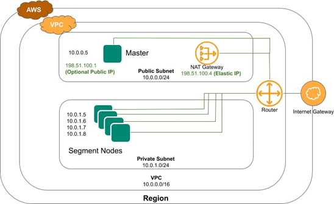

### <a id="vpc"></a>Version History

- GP5 to 5.29.4 support using `gprelease`.
  - [VMware Tanzu Greenplum Database version 5.29.4](https://docs.vmware.com/en/VMware-Tanzu-Greenplum/5/greenplum-database/GUID-relnotes-release-notes.html)
- GP6 to 6.19.2 support using `gprelease`.
  - [VMware Tanzu Greenplum Database version 6.19.2](https://gpdb.docs.pivotal.io/6-19/relnotes/release-notes.html) 

Fixes
-	Included option for displaying ASG status.

Enhancements
-	Upgraded GP6 to version 6.19.2 and GP5 to version 5.29.4. 
-	Upgraded PXF version to 6.2.3 for GP6 and GP5. 
-	Upgraded `pivotal_greenplum_backup_restore` version to 1.24.0 for GP6 and GP5. 
-	Upgraded `plcontainer` version to 2.1.5 for GP6.

#### <a id="ami"></a>GPDB Version Update

#### <a id="vpc"></a>Version 6.7

Fixes
-	Reinstallation / upgrade of Greenplum Command Center using `gpoptional` will no longer drop the database `gpperfmon`.

Enhancements
-	Upgraded GP6 to version 6.19.0 and GP5 to version 5.29.2.
-	Upgraded Command Center versions to 6.6.0 and 4.14.0 for GP6 and GP5 respectively.
-	Upgraded GPCopy version to 2.3.1 for GP6 and GP5.
-	Upgraded `pivotal_greenplum_backup_restore` version to 1.23.0 for GP6 and GP5.
-	Upgraded PostGIS version to `postgis-2.5.4_pivotal.5.build.1` and `postgis-2.1.5_pivotal.3.build.3` for GP6 and GP5 respectively.
-	Upgraded PXF version to 6.2.0 for GP6.
-	Upgraded plcontainer version to `plcontainer-2.1.4` for GP6
-	Upgraded plr version to `plr-3.0.4` for GP6
-	Upgraded madlib version to `madlib-1.18.0` for GP6 and GP5
-	Upgraded DataScience to version `DataSciencePython-2.0.4` for GP6
-	Updated operating system to the latest version.
- Upgraded CentOS 7.9 kernel to 3.10.0-1160.49.1.el7.x86_64.

  - Enhanced gprelease to validate disk space availability before upgrading the server and the
    compatible optional components.
  - Added support for R5b series instance type which has 3x higher EBS-optimized performance
    compared to R5instances.
  - Enhanced gpcompute to additionally support seamless migration of segment instances from R5
    series instance type to R5b series instance type.
- Disable self-healing with gppower asg_pause/asg_resume.
- For enhanced debugging, the ability to start the VM in the case of a disk failure is now enabled by
  default with nofail option.

#### <a id="vpc"></a>Version 6.6

Fixes
-	Confirmation for installation of GPCC using gpoptional.

Enhancements
-	Upgraded GP6 to 6.17.0 and GP5 to 5.28.14.
-	Upgraded Command Center versions to 6.5.0 and 4.13.0 for GP6 and GP5 respectively.
-	Upgraded GPCopy version to 2.3.1 for GP6.
-	Upgraded MADlib version to 1.18.0 for GP6.
-	Upgraded pivotal_greenplum_backup_restore version to 1.21.0 for GP6.
-	Upgraded plr version to 3.0.4 for GP6.
-	Upgraded PostGIS version to postgis-2.5.4+pivotal.4.build.3 for GP6.
-	Upgraded PXF version to 6.1.0 for GP6.
-	Updated operating system to the latest version.
- Upgraded CentOS 7.9 kernel to 3.10.0-1160.42.2.el7.x86_64.
-	Included latest compatible optional component's version for GP5.

#### <a id="ami"></a>Version 6.5

Fixes
-	A gpsnap restore could fail if the restored database cluster does not have a database specified by the environment variable PGDATABASE. During a restore, gpsnap updates the .bashrc file if the PGDATABASE specified doesn't exist in the cluster. It first tries to use "gpadmin" and if that database also doesn't exist, it defaults to template1 which is always available.
-	During an upgrade with gprelease, the optional components may fail to upgrade properly if a package was installed in the database in which gpoptional didn't have the package files for. These missing packages are now skipped by gpoptional during an upgrade.
-	Command Center upgrades no longer drop the gpmon user. This could cause problems if the gpmon user owned objects outside of the gpperfmon database.

Enhancements
-	Upgrade PHP to 7.4
-	Upgraded GP6 to 6.13.0 and GP5 to 5.28.4.
-	Upgraded phpPgAdmin which uses a new Greenplum theme.
-	Upgraded gpview utility.
-	The gpoptional utility will now download any missing packages during an upgrade process to ensure the correct packages are installed with the matching database version.

#### <a id="vpc"></a>Version 6.4

Fixes
-	During a self-healing event of the Master node (mdw) or the first segment node (sdw1), the standby-master is activated. Under rare circumstances, the timeout may be reached which causes the self-healing to stop. If this scenario happens, self-healing will now wait until the standby is activated before proceeding which prevents this problem from happening.
-	The EBS timeout setting was erroneously removed from the kernel setting and went back to the default of 30 seconds. It has been restored to 255 seconds as recommended by AWS.

Enhancements
-	Added Support for AWS Outpost
-	Upgraded GP6 to 6.12.0 and GP5 to 5.28.2.
-	Added GP2 disk option specifically for OLTP and Outpost workloads. There are now three options of SC1 (best price to performance), ST1 (best performance), and GP2 (OLTP and Outpost workloads only).

#### <a id="vpc"></a>Version 6.3

Fixes
-	Fixed "Stack" resource filtering during the deployment and for cloud utilities gppower, gpcompute, and gpgrow. There could be problems if there were multiple Stacks in your AWS account with the same prefix and delimited with a dash. For example, resources for "test" and "test-01" would get merged. Explicit filtering is now in place to prevent this problem.

Enhancements
-	Upgraded GP6 to 6.10.1 and GP5 to 5.28.0.
-	Added Greenplum version GP4 (version 4.3.33) as a parameter.
-	Added xfs_defrag to gpmaintain.
-	Changed memory management by using STATEMENT_MEM instead of spill_ratio in Resource Groups.
-	Patched PHP for phpPgAdmin to the latest stable version.
-	Added TimeZone parameter.
-	Many improvements for gprelease to handle various edge cases.
-	PXF is now installed via gpoptional.

#### <a id="ami"></a>Version 6.2

Fixes
-	Fixed condition where gpmaintain might fail due to a catalog lock.
-	If a self-healing event happened after changing the disk size with gpgrow and/or changing the segment instance type with gpcompute, the original disk size and/or instance type would be used for the new node. This potential problem has been resolved with modifications to gpgrow, gpcompute, and the IAM Role permissions.

Enhancements
-	Updated documentation to reflect VMware Tanzu instead of Pivotal Software.
-	Upgraded VMware Tanzu Greenplum GP6 to version 6.8.1 and GP5 to 5.27.1.
-	Changed default database version to GP6.
-	Upgraded Command Center versions to 6.2 and 4.10 for GP6 and GP5 respectively.
-	Upgraded PostGIS version to 2.5.4 build 3 for GP6.
-	Upgraded PL/Container to version 2.1.2 for GP6.
-	Upgraded MADlib to version 1.17 for GP5 and GP6.
-	Upgraded Cloud gpoptional to now install Backup/Restore utility.
-	Added operating system tools for debugging any problems that might happen (gdb, strace, pstack, sysstat, lsof, dstat, iotop and atop).
-	Updated operating system to the latest version.
-	Updated the default NVME timeout from 30 seconds to 255 seconds. This can help prevent timeout issues in AWS EBS storage.

#### <a id="vpc"></a>Version 6.1

Fixes
-	Installation of PL/Container during the initial deployment of a cluster could cause a timeout because of the time it takes to install all of the docker images. To prevent this, PL/Container can only be installed with the command line utility gpoptional rather than as a parameter in the template.
-	Some web browsers prevent the use of self-signed SSL certificates so phpPgAdmin has switched to http rather than https. It is recommended that you install your own certificate and use SSL post- installation.
-	The bouncer utility was displaying the wrong program name in the INFO messages. This issue has been resolved.
-	The URL output for Command Center would be blank when deploying a cluster without a public Internet address. This issue has been resolved.
-	The wrong database version would be displayed in the message of the day after a database upgrade with gprelease. This issue has been resolved.

Enhancements
-	Upgraded Pivotal Greenplum GP6 to version 6.6.0 and GP5 to 5.26.
-	Deployments now rely on the private IP addresses only rather than using the internal DNS names. This prevents a potential deployment problem when deploying to an existing VPC that doesn't have DNS.
-	Updated kernel to latest version available.
-	Command Center is now installed by default.

#### <a id="ami"></a>Version 6.0

Enhancements
-	Added gpcompute utility which allows customers to scale compute independently from storage either up or down (r5.2xlarge, r5.4xlarge, and r5.8xlarge). This required IAM_User privileges changes and is not compatible with earlier versions in AWS.
-	Upgraded Pivotal Greenplum GP6 to version 6.4.0 and GP5 to 5.25.
-	Added Database Name parameter so customers can specify the default database name.
-	Added core file generation to make it easier to debug issues with Support.
-	Removed PlacementGroup and Tenancy parameters to simplify deployment and increase the likelihood that AWS would have enough resources to resume a paused cluster.

#### <a id="vpc"></a>Version 5.1

Fixes
-	Updated the check_disk.sh script so that calculates the size of the file to test by looking at the size of the segment instance rather than relying on the master.
-	Self-healing now restores the Command Center binaries on segment instances.

Enhancements
-	Added PL/Container optional install.
-	Added Disk Type parameter of SC1 or ST1 for the data volumes in the cluster. SC1 is the recommended disk type.
-	Added ability to specify the disk type when restoring a snapshot.
-	Simplified the disk formatting process during deployment.
-	Snapshot restores will now reset the gpadmin password of the database. This is useful when restoring a snapshot from a different cluster and the password won't match.
-	Ran a yum update to update for new security patches.

-	Upgraded Pivotal Greenplum GP6 to version 6.3.0 and GP5 to 5.24.
-	Changed the count of segment instances from a multiple of 4 to 2.

#### <a id="vpc"></a>Version 5.0

Fixes
-	Updated logic for scheduled maintenance to ensure it doesn't execute while it is already running.
-	The gpcronsnap crontab entry was missing.
-	The gpsnap utility restore functionality wasn't working correctly for r5 instance types.
-	Changed when the gpmon password is set during Command Center installation so that it prevents fatal login messages in the GUI.
-	Updated pg_hba.conf file settings automatically during deployment and recovery so that it always has hostnames and not ip addresses. This makes snapshot restoration much more reliable.

Enhancements
-	Added DatabaseVersion parameter to indicate either GP5 or GP6 major version to install.
-	Added Pivotal Greenplum version 6.1.0 and upgraded GP5 to 5.23.
-	Added status parameters to both gpgrow and gppower.

#### <a id="ami"></a>Version 4.3

Version 4.3

Fixes
-	During a deployment into an existing VPC where a non-default DNS suffix is used, the assignment of instances to roles did not work properly.
-	"set-hostname" was executed twice during a deployment for each instance.
-	A CLI command during a deployment incorrectly used an "or" operator instead of "and" for a query with multiple filters.
-	Added "create extension" when initializing PXF.

Enhancements
-	Added ability to grow storage independently from compute with gpgrow.
-	Added ability to pause / resume a cluster with gppower.
-	Reduced storage costs by 44% with the same performance.
-	Added encryption to swap volume.
-	Updated template to use "AWS::EC2::LaunchTemplate" rather than "AWS::AutoScaling::LaunchConfiguration". This makes it easier to update the template to update the Block Device Mapping and use an existing KMS Key ID.
-	Ran yum update to update to CentOS 7.7.
-	Added S3 endpoint to reduce S3 costs.
-	Enhanced deployment scripting to throttle CLI commands to prevent issues with deploying large clusters.
-	Removed analyzedb when Master Instance is recovered as this is no longer recommended.
-	Disabled gpperfmon for Command Center as starting with version 4.8, it is recommended to not use gpperfmon_install.
-	Updated operating system limits settings.
-	Removed anlayzedb on master self-healing event.
-	Changed device mapping in fstab file to UUID.

#### <a id="vpc"></a>Version 4.2

Enhancements
-	Upgraded to Pivotal Greenplum 5.20.1 and Command Center 4.7.0.
-	Upgraded CentOS kernel to 7.6.
-	Added ability to deploy in an existing VPC.
-	The Segment nodes no longer have a public IP address assigned which further enhances security of Pivotal Greenplum on AWS.
-	Master node instance type is now parameterized so that a different and less expensive instance type can be used for the Master node.
-	Master node disk size is now parameterized so that a smaller and less expensive size can be used on the Master node.
-	Added deployment parameter to specify if the Master node will have a public ip address or not.
-	Removed D2 series instance types so that all instances uses persistent, EBS volumes.
-	Optimized number of disks and segments for each instance type.
-	Timezone on VMs are now set based on where the cluster is deployed.
-	The gpoptional tool now displays which database packages will be installed.
-	Tag enhancements for snapshot backups so that snapshots will be filtered by the database version (GP5 vs GP6).

#### <a id="vpc"></a>Version 4.1

Fixes
-	gpcrondelete maintains n snapshots determined in the gpcronsnap.conf file. The delete process would delete snapshots from other clusters to maintain the determined number of snapshots.
Starting with 4.1, gpcronsnap will only delete snapshots that exceed the number and have been created by the currently running cluster.
-	gpsnap restore for R5 series could sometimes mount volumes in the incorrect order.
-	Rebooting machines could change the mount order for R5 series instances.

Enhancements
-	Created a new binary installer for the greenplum-cloud utilities. This makes it easier to upgrade these utilities via gprelease.
-	GP Browser renamed back to phpPgAdmin. It has enhancements for a Pivotal template and handling of partitioned tables. Installation is done via an RPM.
-	Add caching of ssh keys between the segments back to the master
-	Added SSL to pgBouncer
-	gprelease now updates cloud utilities
-	Added new sysctl.conf entries for better memory management
-	Added disk size parameter
-	Added disk encryption parameter
-	Added tenancy parameter
-	Changed drop down list of Subnet CIDRs to a text box to give more flexibility
-	Reboots now reset the blockdev read ahead for data disks
-	Enable Resource Groups by default instead of Resource Queues
-	Automated maintenance with gpmaintain and gpcronmaintain

#### <a id="ami"></a>Version 4.0

Fixes
-	Enhanced the SSM delete action to better handle removal of old Pivotal Greenplum related keys without removing non-Greenplum keys.

Enhancements
-	Upgraded Greenplum to 5.17.0 and Greenplum Command Center to 4.6.0.
-	Added support for PXF and included OpenJDK.
-	Enhanced Greenplum Command Center installer to better handle future upgrades.
-	Added ClusterSubnet parameter.
-	Improved check_disk and check_network scripts in
/opt/pivotal/greenplum/validation/performance

#### <a id="vpc"></a>Version 3.2

Fixes
-	Fixed issue with self-healing on the Master where a script could hang.

Enhancements
-	Upgraded Greenplum to 5.16.0 and Greenplum Command Center to 4.5.1.
-	Enhanced gprelease/gpoptional to migrate existing packages that are installed and upgrade packages if needed.
-	Improved database initializing performance so deployments are completed faster

#### <a id="ami"></a>Version 3.1

Fixes
-	Resolved issue where gprelease failed if a package directory exists but no packages are installed.

Enhancements
-	Upgraded Greenplum to 5.13.0
-	Removed standby-master host and process now runs on first segment host
-	Added GP Browser SQL utility
-	Added R5 Series instance types which has enhanced the performance of Greenplum on AWS

#### <a id="vpc"></a>Version 3.0

Enhancements
-	Upgraded Greenplum to 5.12.0
-	Upgraded Greenplum Command Center to 4.4.0
-	Disaster Recovery with gpsnap (create, copy, and restore)
-	Restore snapshot from a different cluster (same configuration)
-	Upgrade CloudFormation by using gpsnap

-	Standardized hostnames (mdw1, mdw2, sdw1, sdw2, etc)

#### <a id="vpc"></a>Version 2.4

Enhancements
-	Upgraded Greenplum to 5.10.2.
-	Upgraded Greenplum Command Center to 4.3.1
-	Added bouncer pause and resume functions
-	Added Self-Healing
-	Renamed gpupgrade and gpcronupgrade to gprelease and gpcronrelease
-	gprelease and gpcronrelease enhanced for better integration to optionally installed components
-	gpoptional tool created to make it easier to install optional components and also upgrade existing components.

Fixes
-	Fixed loop during Message of the Day creation on the Master during a self-healing event.

#### <a id="ami"></a>Version 2.3.1

Enhancements
-	Upgraded Greenplum Command Center to version 4.2.0

#### <a id="vpc"></a>Version 2.3

Fixes
-	Corrected the number of segments per host for r4.16xlarge and EBS Encrypted drives
-	Updated a script for a slight change in behavior from "aws ec2 describe-instances" CLI command that initially returns "None" for the Stack name.

Enhancements
-	Upgraded Pivotal Greenplum database to version 5.9
-	Upgraded Operating System to CentOS 7.5
-	Increased root volume size from 8GB to 32GB
-	Wrapped message of the day on ssh login to 80 characters wide
-	Revised pgBouncer default settings and added "bouncer" utility
-	Upgraded Greenplum Command Center to version 4.1.1
-	Added Data Science Python and R packages as optional installs
-	Improved gpsnap performance
-	Pause pgBouncer on self-healing segment recovery so that active queries won't be cancelled

#### <a id="vpc"></a>Version 2.2

Fixes
-	Patched the operating system for the Meltdown and Spectre vulnerabilities.


-	When a single node install had the node replaced because of failure, the auto-healing feature wouldn't re-initialize the database and left the single node in an unusable state.
-	Increased the MaxStartups sshd configuration to prevent unwanted failed ssh attempts from preventing the cluster from initializing.

Enhancements
-	Manage EBS Snapshots with two new tools; gpsnap and gpcronsnap
-	Manage Greenplum Database upgrades with two new tools; gpupgrade and gpcronupgrade
-	Optional installs are now available as parameters to the Cloud Formation Template and visible in the Marketplace. Optional installs are still available post-installation.
-	Added Postgis as an optional install.
-	Removed csv files used during the installation that contained the public and private keys.
-	Updated the temporary gpadmin password to a more secure value. Password authentication is only temporarily enabled during the installation process.
-	Store the randomly generated admin password in the AWS Parameter Store so that it can be retrieved in case the Master fails.
-	Updated the ip_local_port_range to start at 10,000 so the database interconnect doesn't interfere with gpfdist ports.

#### <a id="ami"></a>Version 2.1

Fixes
-	r4.xlarge, r4.2xlarge, and r4.4xlarge encrypted disk options did not properly set encryption on.
-	Resolved installation issue for optional Command Center where excessive log files were created in the gpadmin home directory.

Enhancements
-	Upgraded to GPDB 5.2.
-	Stack is now self-healing. If the Auto Scaling Group replaces a bad node, the node will automatically be replaced and added back into the Greenplum cluster properly. An Elastic IP address keeps the IP address the same if the Master were to fail.
-	Configured pgBouncer load balancer to be the default connection mechanism for clients.
-	Upgraded optional installs of Command Center, Madlib, and PL/R to the latest versions.
-	Dynamically set swap size based on the instance type chosen.
-	Removed /data[2-4] volumes from the Master and Standby.
-	Snapshot permissions added to the IAM permissions list to make it easier to automate taking EBS snapshots for a backup.
-	Yum update performed.

#### <a id="vpc"></a>Version 2.0

Fixes
-	Fixed MOTD calculation for available disk space for single node installs.
-	Fixed issue where /etc/rc.local was restarting the network after CloudFormation script finished. This sometimes caused status checks to fail in AWS for a single node in a Stack and then the node would get terminated.

Enhancements
-	Upgraded to GPDB 5.
-	Enhanced Stack Output to have more detailed information including username, password, Master node, ssh location, instance type, instance count, ssh key name, availability zone, additional installs path, validation scripts path, and the Pivotal API token value.
-	Modified wait in deploying nodes to make sure both AWS checks pass for each node before assigning roles and installing the database.
-	Added d2.xlarge, d2.2xlarge, r4.xlarge, r4.2xlarge, and r4.4xlarge instance types.
-	Dynamically set instance tenancy based on instance type. 8xlarge and 16xlarge large nodes are deployed in dedicated tenancy while the others are in shared.
-	Removed API Token parameter.
-	Enhanced optional installer to use local copies of the install files rather than dynamically downloading it.

#### <a id="ami"></a>Version 1.3

Enhancements
-	Upgraded to CentOS 6.9.
-	Updated Greenplum version to 4.3.14.0.
-	Added support for Enhanced Networking that uses the ENA driver. Now both Enhanced Networking drivers are installed and will AWS will automatically use the correct driver.
-	Added support for r4.8xlarge and r4.16xlarge instance types.
-	Added RaiseError condition to make debugging errors easier.
-	Changed API Token to be optional per Amazon request.
-	Changed root and swap partitions from 500GB and 50GB respectively to 8GB each. This reduces the cost to customers using AWS as it was determined Greenplum doesn't need that much space for root and swap disks.
-	Added build_ami directory with scripts used to prepare a minimal install image of CentOS 6.9.

#### <a id="vpc"></a>Version 1.2

Enhancements
-	Upgraded to CentOS 6.9.
-	Updated Greenplum version to 4.3.14.0.
-	Added support for Enhanced Networking that uses the ENA driver. Now both Enhanced Networking drivers are installed and will AWS will automatically use the correct driver.
-	Added support for r4.8xlarge and r4.16xlarge instance types.
-	Added RaiseError condition to make debugging errors easier.
-	Changed API Token to be optional per Amazon request.
-	Changed root and swap partitions from 500GB and 50GB respectively to 8GB each. This reduces the cost to customers using AWS as it was determined Greenplum doesn't need that much space for root and swap disks.
-	Added build_ami directory with scripts used to prepare a minimal install image of CentOS 6.9.

#### <a id="vpc"></a>Version 1.1

Fixes
-	Created default database.
-	Set gpadmin password.
-	Added entry to pg_hba.conf file to allow encrypted password connection from remote nodes.
-	Removed Command Center reference on Segment nodes.
-	Removed ephemeral disks when EBS is chosen.
-	Fixed disk sizes. data1 is smaller than data2-4.
-	Fixed permissions for /usr/local and /usr/local/greenplum-db/*. World writable permissions set for most all files.

Enhancements
-	Uses st1 disks instead of gp2 for better performance.
-	Allows for 18 nodes so this is equivalent to a full rack.
-	Made Command Center an optional install.
-	Added API Token as a parameter to be able to track customers and allow them to automatically download optional installs.
-	Removed redundant parameters for ClusterName and using Stack Name instead.
-	Removed i2.8xlarge instance type because it is more expensive than d2.8xlarge and not as fast.
-	Added d2.4xlarge for Dev/Test purposes.
-	Simplified scripting to a single execution of a script stored in the AMI. This script then calls all scripts to complete the install. Scripts are also numbered 001, 002, 003, etc to make the execution order obvious.
-	Enhanced the xfs mounting options for better performance.
-	Changed the number of Segments per node from 8 to 12 for d2.8xlarge while keeping 8 for d2.4xlarge.
-	Simplified template for easier maintenance.
-	AMI can dynamically download scripts from S3 to make development easier.
-	AMI can disable execution of the scripts to make development and debugging easier.
-	Added Encrypted EBS option.
-	Added Message of the Day on the Master node that explains how to use the database.
-	Updated gp_vmem_protect_limit based on instance type
-	Updated sysctl.conf vm.overcommit_ratio from the default of 50 to 95.

#### <a id="ami"></a>Version 1.0

Initial release.
